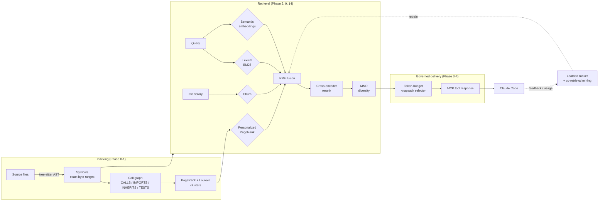

# Loupe

**AST-aware context orchestration for Claude Code.**

Loupe is an MCP server that gives Claude surgical access to a codebase — exact symbols instead of whole files, ranked by relevance instead of guessed, governed by a real token budget instead of dumped in wholesale. Point it at a repo, connect it to Claude Code, and every retrieval becomes a precise, explainable decision instead of "paste the file and hope."

```
naive ("read the whole file")     ~6,700 tokens/task
Loupe (exact symbols, ranked)     ~1,000–3,100 tokens/task    →  6×+ fewer tokens
```

*Real numbers, not marketing copy — see [Honest results](#honest-results) below.*

---

## The problem

Claude Code is excellent at reasoning about code it can see. The bottleneck is what it *gets* to see. The default options are both bad:

- **Paste the whole file** — burns tokens on code that has nothing to do with the question, crowds out budget for actually reasoning about the answer, and doesn't scale past a few files.
- **Naive chunking** (fixed-size text windows, the standard RAG approach) — splits a function in half, loses the surrounding class context, and ranks purely on text similarity with no idea which code is structurally important.

Loupe replaces both with something closer to how a senior engineer actually navigates a codebase: know the exact boundary of a function or class, know what calls it and what it calls, know which parts of the repo are structurally central, know what's been touched recently — and use all of that to hand over *exactly* the right symbols, nothing more.

---

## Honest results

Every number below comes from Loupe's own evaluation harness, run against real repositories (including Loupe's own git history) — not synthetic fixtures picked to flatter the result. Where the data was too thin to make a claim (e.g. the learned ranker needs 200+ labeled examples before it trains at all), that's reported honestly as "not enough data yet," not papered over with a simulated number.

| Measurement | Result | Source |
|---|---|---|
| Token cost vs. naive whole-file loading | **6.3× fewer tokens** (oracle condition, real repo) | `benchmarks/results/` |
| Recall@5 / Recall@10 on real, git-mined tasks | **1.0 / 1.0** (7 real commits from Loupe's own history) | `benchmarks/results/` |
| Fused retrieval (lexical + semantic + centrality) vs. either signal alone | fused **≥** best single signal, every adversarial query tested | `core/tests/test_fusion.py` |
| Test suite | **480 tests passing** across 3 packages, real models — no mocked embeddings | `core/`, `mcp_server/`, `cli/` |

The evaluation harness also mines a project's *own* git history into benchmark tasks automatically (`loupe_core/eval/mine_history.py`) — every claim above is reproducible against any repo, including this one.

---

## How it works



Six original build phases (foundations → graph → retrieval → governor → server → evaluation) plus a second wave (self-improving retrieval, blast-radius analysis, personalized ranking, graph clustering, context engineering, adaptive compression, and a zero-cost static-analysis pack) — all shipped, all tested against real code, not just fixtures.

---

## Feature tour

**Precision retrieval.** Lexical (BM25) + semantic (local embeddings) + structural (query-personalized PageRank) + temporal (git-churn-weighted recency) signals fused via Reciprocal Rank Fusion, refined by a cross-encoder, diversified by MMR so five near-duplicate getters don't crowd out a genuinely different match.

**A real symbol graph, not a guess.** Tree-sitter extracts exact byte ranges for every function/class/method; a deliberately conservative call resolver (no type inference, never guesses) builds `CALLS`/`IMPORTS`/`INHERITS`/`TESTS` edges. Louvain clustering finds the repo's real architectural boundaries — used for auto-scoping sub-agents and generating architecture summaries, not folder-guessing.

**A token governor that means it.** Every response is billed against a real per-session budget with knapsack selection and LRU-style eviction — "already sent this turn" costs zero, a sibling method's shared class context isn't re-billed once you've already paid for it once.

**Self-improving.** A logistic-regression ranker retrains on real usage feedback once enough data exists (with an honest cold-start fallback to plain RRF, never a fabricated training set). Co-retrieval mining learns which symbols get requested together.

**Context engineering.** Generates a real `CLAUDE.md` from auto-detected conventions and architecture (knapsack-budgeted, so it doesn't bloat either) — plus a session-notes scratchpad that survives conversation compaction, and scope-aware retrieval for sub-agents that can see outside their lane without being blinded to it.

**Static analysis, for free.** Dead code, duplicate code, config/env-var drift, ORM migration drift, and breaking API-contract changes — all reused from data Loupe already computed, none of it touching Claude's context budget unless asked for.

**[Lens](lens/)** — a local React/Vite dashboard visualizing the symbol graph, telemetry, and conventions reports, reading Loupe's own REST endpoints directly.

---

## MCP surface

Loupe deliberately keeps its **tool** count small — every addition is weighed against real accuracy degradation from tool-selection overload. Bulk read-only reports go through MCP **Resources** instead, which cost nothing against that budget.

| Tool | Purpose |
|---|---|
| `list_symbols` | Glob/kind-filtered symbol listing, with scope and file-summary granularity |
| `search_symbols` | The full hybrid retrieval pipeline |
| `get_symbol` | Full source extraction, governed by the token budget, with class-context decomposition for large symbols |
| `expand_dependencies` | Bounded graph traversal (callers/callees/both) |
| `analyze_impact` | Blast-radius analysis: what breaks if this changes |
| `find_code_smells` | 8 FastAPI-aware static checks (missing response models, N+1 queries, god objects, circular deps, …) |
| `submit_feedback` | Conversational feedback on a retrieval, feeding the learned ranker |
| `session_notes` | A scratchpad that survives compaction, decay-ranked and deduplicated |

| Resource | Purpose |
|---|---|
| `conventions://summary` | Auto-derived repo conventions (error handling, docstrings, imports) |
| `architecture://overview` | One-paragraph repo summary + per-cluster architecture map |
| `static-analysis://summary` | The zero-cost static analysis pack's findings |

---

## Quick start

```bash
# 1. Set up each package in its own editable venv (core -> mcp_server -> cli)
cd core        && python -m venv .venv && .venv/bin/pip install -e .
cd ../mcp_server && python -m venv .venv && .venv/bin/pip install -e ../core -e .
cd ../cli        && python -m venv .venv && .venv/bin/pip install -e ../core -e ../mcp_server -e .

# 2. Point Loupe at a repo
cd /path/to/your/project
/path/to/Loupe/cli/.venv/bin/loupe init      # writes loupe.manifest.yaml + .loupeignore
/path/to/Loupe/cli/.venv/bin/loupe index     # full index, prints a summary
/path/to/Loupe/cli/.venv/bin/loupe serve     # starts the MCP server on :8765

# 3. Connect Claude Code
claude mcp add --transport http loupe http://127.0.0.1:8765/mcp
```

That's it — `search_symbols`, `get_symbol`, and the rest are now available to Claude in that project.

---

## CLI reference

| Command | Does |
|---|---|
| `loupe init` | Generate `loupe.manifest.yaml` + `.loupeignore` |
| `loupe index` | Full or incremental index, prints a summary |
| `loupe serve` | Start the MCP server (also watches for live file changes) |
| `loupe status` | Index freshness, without touching anything |
| `loupe check [--since <ref>]` | Run the static analysis pack; `--since` adds API contract diffing |
| `loupe generate-context` | Write/update `CLAUDE.md` from detected conventions + architecture |
| `loupe update-churn` | Recompute git-churn ranking signal |
| `loupe update-suggestions` | Mine co-retrieval suggestions from usage telemetry |
| `loupe retrain` | Retrain the learned ranker from accumulated feedback |

---

## Project layout

A monorepo, each package independently installable:

```
core/         loupe_core         — framework-free: parsing, graph, retrieval, governor, evaluation
mcp_server/   loupe_mcp_server   — FastAPI + MCP, exposes core over HTTP
cli/          loupe_cli          — the `loupe` command
scaffold/     loupe_scaffold     — `loupe new`: elicitation engine for scaffolding new FastAPI projects
lens/                            — React/Vite dashboard over Loupe's own local data
```

Every phase was built against a hand-written spec, then verified by dogfooding — running the tool against real, unrelated codebases (and against its own) rather than trusting fixture tests alone. That discipline caught several real, non-obvious bugs late in the build: a stdlib-name call-resolution collision, three separate output-size limits found by actually blowing past them, and a genuine cross-thread SQLite connection bug that only manifested with a live server mid-reindex — all fixed, all now regression-tested.

---

## Status

The core roadmap (foundations → retrieval → governor → server → evaluation → self-improvement), all four original extensions (blast-radius analysis, test linkage, feedback loop, auto-derived conventions), Scaffold's elicitation engine, the Lens dashboard, and a second roadmap wave (retrieval precision upgrades, graph clustering, context engineering, adaptive context compression, and the zero-cost static analysis pack) are complete and tested. Compute-profile model tiers are partially wired; an experimental-feature gate (for future paid-API-backed features like HyDE query rewriting) is scoped but not yet built — deliberately: Loupe has made zero paid API calls anywhere in its own operation so far, and that's a line worth keeping deliberate about crossing.
